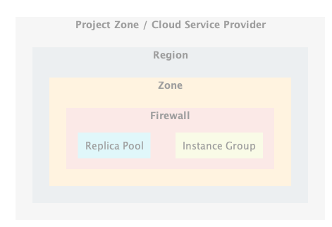
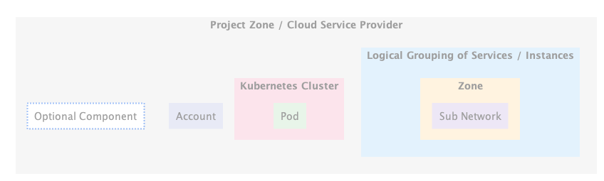
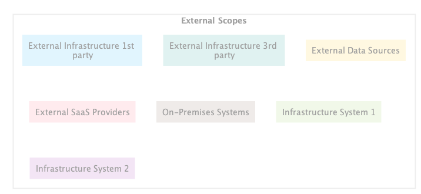

# GCP-PlantUML
[PlantUML](https://plantuml.com) sprites, macros and stereotypes for creating PlantUML diagrams with [Google Cloud Platform](https://cloud.google.com) components.

## Reference Architecture

### Dynamic Web-Hosting


## Projects and Zones

### Example 1

```js
@startuml ProjectAndZones1
!define GCP_IUML https://raw.githubusercontent.com/deepak-bhardwaj-ps/GCP-PlantUML/master/dist
!includeurl GCP_IUML/Common/GCPCommon.iuml
!includeurl GCP_IUML/Scopes/Scopes.iuml

Project_Zone(project1, "Project Zone / Cloud Service Provider") {
  Region(rgn1, "Region") {
    Zone(z2, "Zone") {
      Firewall(fw1, "Firewall") {
        Instance_Group(ig1, "Instance Group")
        Replica_Pool(rp1, "Replica Pool")
      }
    }
  }
}
@enduml
```



### Example 2

```js
@startuml ProjectAndZones2
!define GCP_IUML https://raw.githubusercontent.com/deepak-bhardwaj-ps/GCP-PlantUML/master/dist
!includeurl GCP_IUML/Common/GCPCommon.iuml
!includeurl GCP_IUML/Scopes/Scopes.iuml

Project_Zone(project1, "Project Zone / Cloud Service Provider") {
  Logical_Group(lg1, "Logical Grouping of Services / Instances") {
    Zone(z1, "Zone") {
      Sub_Network(sn1, "Sub Network")
    }
  }
  GKE_Cluster(gke1, "Kubernetes Cluster") {
    Pod(pod1, "Pod")
  }
  Account(acc1, "Account")
  Optional_Component(Optional_Component1, "Optional Component")
}
@enduml
```



### Example 3

```js
@startuml ProjectAndZones3
!define GCP_IUML https://raw.githubusercontent.com/deepak-bhardwaj-ps/GCP-PlantUML/master/dist
!includeurl GCP_IUML/Common/GCPCommon.iuml
!includeurl GCP_IUML/Scopes/Scopes.iuml

Scope(Scope1, "External Scopes") {
  External_Infra_1P(ei1p, "External Infrastructure 1st party")
  External_Infra_3P(ei3p, "External Infrastructure 3rd party")
  External_Data(External_Data1, "External Data Sources")
  External_SaaS(External_SaaS1, "External SaaS Providers")
  On_Premise(On_Premise1, "On-Premises Systems")
  System1(System11, "Infrastructure System 1")
  System2(System21, "Infrastructure System 2")
}
@enduml
```


