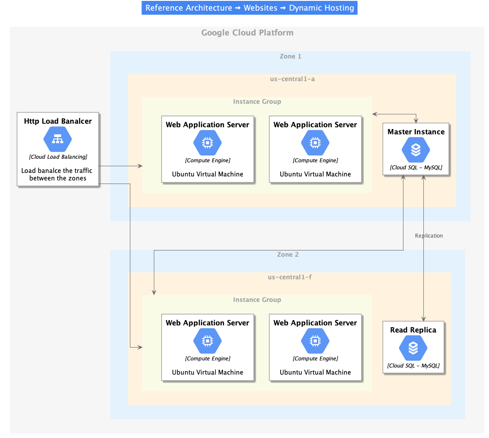

# GCP-PlantUML
[PlantUML](https://plantuml.com) sprites, macros and stereotypes for creating PlantUML diagrams with [Google Cloud Platform](https://cloud.google.com) components.

## Reference Architecture

### Dynamic Web-Hosting

